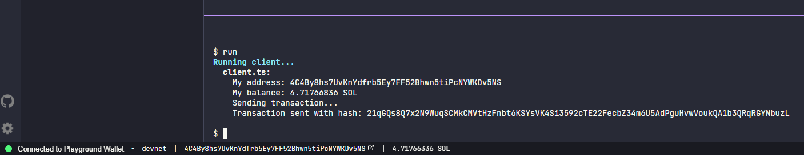

# Solana Playground

## My Transaction:
https://explorer.solana.com/tx/21qGQs8Q7x2N9WuqSCMkCMVtHzFnbt6KSYsVK4Si3592cTE22FecbZ34m6U5AdPguHvwVoukQA1b3QRqRGYNbuzL?cluster=devnet

## Running on Solana's playground
https://solana.com/developers/guides/getstarted/hello-world-in-your-browser

## How to run locally
### Install tools
Instructions on how to install Solana can be found here.
https://docs.solanalabs.com/cli/install

#### Install dependencies
Extract the zip file in your project's directory and run:

yarn
Build

cd program
cargo build-sbf
Start a local test validator

solana-test-validator
Test

yarn test
Run client

yarn client

**Note You might need to adjust the client and test code to fully work in local Node environment since there are playground exclusive features, e.g. if you are using pg.wallets.myWallet, you'll need to manually load each keypair.**